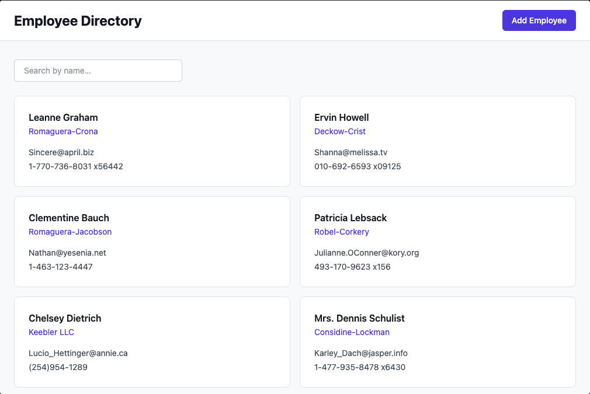

# Employee Directory

A React training project built across a 4-session programme for backend engineers making their first hands-on steps with React, TypeScript, and modern front-end tooling.



## Project Overview

The Employee Directory lets you browse, search, and add employees. It is a single feature intentionally kept narrow so each session builds on the last without introducing unrelated complexity.

### Features

- **Employee list** — responsive grid of cards showing name, department, email, and phone
- **Employee detail** — full profile view accessed via React Router
- **Search** — real-time client-side filter by name
- **Add Employee form** — validated with React Hook Form and Zod; mutations are mocked by the API

### Tech Stack

| Tool                           | Purpose                                       |
| ------------------------------ | --------------------------------------------- |
| Vite + React + TypeScript      | Application framework (strict mode)           |
| Tailwind CSS v3                | Utility-first styling                         |
| React Router v6                | Client-side routing                           |
| TanStack Query v5              | Server state and data fetching (Sessions 2–3) |
| React Hook Form + Zod          | Forms and validation (Sessions 2–4)           |
| Storybook v8                   | Component documentation                       |
| Vitest + React Testing Library | Unit and integration tests                    |
| Playwright                     | End-to-end tests                              |
| Apollo Client v3               | GraphQL client (Session 4)                    |

---

## Branch Structure

Each branch represents the **completed state going into** the named session. Check out the branch at the start of a session and build forward from it.

| Branch            | Contents                                                                                                                                           |
| ----------------- | -------------------------------------------------------------------------------------------------------------------------------------------------- |
| `main`            | This README only                                                                                                                                   |
| `session-1-start` | Full tooling scaffold — Vite, Tailwind, Storybook, React Router, TanStack Query provider, folder structure. No feature code yet.                   |
| `session-2-start` | Session 1 complete: `EmployeeCard`, `EmployeeList`, TanStack Query hooks, list and detail pages working, Storybook story for `EmployeeCard`.       |
| `session-3-start` | Session 2 complete: `AddEmployeeForm` with React Hook Form + Zod, accessible form markup, loading/error states throughout.                         |
| `session-4-start` | Session 3 complete: RTL unit tests for `EmployeeCard` and `AddEmployeeForm`, Playwright E2E test, accessibility audit passed.                      |
| `solution`        | Session 4 complete: Apollo Client migration, GraphQL queries/mutation, layered architecture refactor, micro frontend integration point documented. |

---

## API

### REST (Sessions 1–3)

**Base URL:** `https://jsonplaceholder.typicode.com`

| Endpoint     | Method | Description                                                    |
| ------------ | ------ | -------------------------------------------------------------- |
| `/users`     | `GET`  | List all 10 employees                                          |
| `/users/:id` | `GET`  | Fetch a single employee                                        |
| `/users`     | `POST` | Simulate adding an employee (always returns a mocked `id: 11`) |

### GraphQL (Session 4)

**Endpoint:** `https://graphqlzero.almansi.me/api`

**Interactive explorer (GraphiQL):** [https://graphqlzero.almansi.me/api](https://graphqlzero.almansi.me/api) — open this URL in a browser to explore the schema and run queries against it.

No authentication required. GraphQLZero is a public read/write API backed by JSONPlaceholder data; mutations return mocked responses.

**Key types used in this project:**

```graphql
type User {
  id: ID!
  name: String!
  email: String!
  phone: String
  website: String
  company: Company
  address: Address
}

type Company {
  name: String!
}

type Address {
  street: String
  suite: String
  city: String
  zipcode: String
}
```

---

## Session Checkpoints

| Session | Checkpoint Goal                                                                                                   |
| ------- | ----------------------------------------------------------------------------------------------------------------- |
| 1       | A styled, typed `EmployeeCard` rendering real data, documented in Storybook                                       |
| 2       | Full list and detail pages with live data, plus a validated Add Employee form                                     |
| 3       | Meaningful test coverage on core components, Playwright E2E covering the happy path, A11Y audit passing           |
| 4       | Data layer migrated to Apollo Client + GraphQL, layered architecture, micro frontend integration point documented |

---

## Setup

### Prerequisites

- Node.js 20 or later
- npm 10 or later

### Getting Started

```bash
# Clone the repo and check out the session branch you need
git clone <repo-url>
cd employee-directory
git checkout session-1-start

# Install dependencies
npm install

# Start the development server  (http://localhost:5173)
npm run dev

# Start Storybook  (http://localhost:6006)
npm run storybook

# Run unit tests (Vitest)
npm run test

# Run E2E tests — session-4-start and solution branches only
npx playwright install --with-deps chromium
npm run test:e2e
```

---

## Sessions 1, 2 & 3 — Completed

Full feature (list, detail, Add Employee form), unit tests, Playwright E2E, and accessibility fixes are all built and working on this branch.

---

## Session 4 Homework

**Goal:** Migrate the data layer from TanStack Query (REST) to Apollo Client (GraphQL).

### Setup

```bash
npm install @apollo/client graphql
```

### Steps

1. **`src/lib/apolloClient.ts`** — connect to `graphqlzero.almansi.me/api` (see file for requirements)
2. **`src/graphql/queries.ts`** — define `GET_EMPLOYEES`, `GET_EMPLOYEE`, `CREATE_EMPLOYEE` (see file for requirements)
3. **`src/hooks/useEmployeesGQL.ts`** — return `{ data, isLoading, isError, error }` shape (see file for requirements)
4. **`src/hooks/useEmployeeGQL.ts`** — with `skip: id <= 0` (see file for requirements)
5. **`src/App.tsx`** — remove `QueryClientProvider`, add `ApolloProvider` with the client from step 1
6. **`src/pages/EmployeeListPage.tsx`** — swap `useEmployees` import to `useEmployeesGQL` (one line)
7. **`src/pages/EmployeeDetailPage.tsx`** — swap `useEmployee` import to `useEmployeeGQL` (one line)
8. _(Stretch)_ **`src/components/AddEmployeeForm.tsx`** — replace `fetch()` with Apollo `useMutation`

### You're done when

- `npm run dev` shows employee cards fetched from GraphQL
- `npm run test:e2e` still passes
